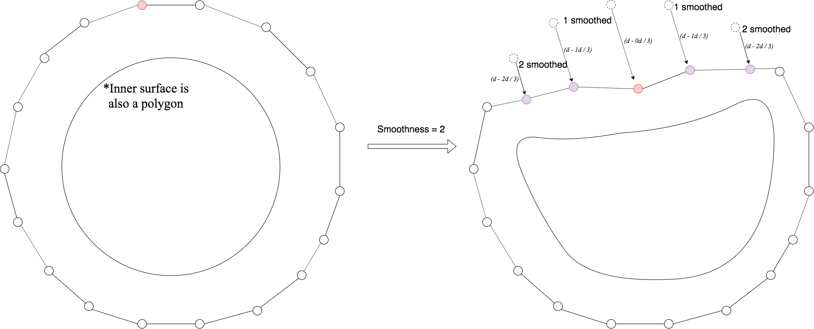

# Introduction

This project is a renderer, using *[nanogui](https://github.com/wjakob/nanogui)*, of a particular Simulated Annealing algorithm that calculates the folding of the cerebellum (yes, the actual part of the brain) in 2 dimensions (which can lead to valid extrapolations since the cerebellum folds uniformly across dimensions) based on an energy function that is an estimate of [a surface's Free Energy](https://en.wikipedia.org/wiki/Surface_energy).

## Installation

### Step 1. Install dependency packages (will be automated with a script in the future)
First, clone this repository with `git clone --recursive`. This will automatically include any git submodules it depends on.

Most of the packages that need to be installed can be obtained via [Homebrew](https://brew.sh/) on Mac OS (Xcode command line tools obviously need to be installed as well). Out of the following packages, the only one that is not more easily installed with Homebrew's `brew` command is LEMON:

_Packages_:
* [LEMON](https://lemon.cs.elte.hu/trac/lemon/wiki/InstallLinux) (depends on [CMake](https://cmake.org/))
* [GLFW](https://www.glfw.org/)
* [GLEW](http://glew.sourceforge.net/)
* [FTGL](http://ftgl.sourceforge.net/docs/html/ftgl-tutorial.html)

_Libraries_:
* [CGAL](https://www.cgal.org/) # For the way faster (n lg n) sweep-line algorithm for intersection detection

### Step 2. Installation and note on Nanogui
Nanogui is included as a submodule. This means that cloning this repository recursively will also obtain nanogui's code, but it still has to be built from source. Thankfully, the process is straightforward. The steps to build nanogui are as follows, after cloning this repo:
1. `cd nanogui`
2. `mkdir build` (this is normally standard for CMake-based projects and libraries)
3. `cd build`
4. `cmake ..`
5. `make`

After that, change directories back to the repo's root with `cd ../..` and run `make` and that should be enough to produce an executable.

## Overview of the model

### Simulated Annealing
The model is based on *Two polygons with the same amount of sides*, one internal and one external. It follows the
Simulated Annealing algorithm by iteratively performing a step function, called `Optimizer::stepSimulatedAnnealing`. Before
describing what an iteration of this instance of the SA algorithm does, here are a few definitions:
* A ***surface*** is represented by a mere polygon. It is essentially a circular graph.
* A ***thick surface*** is represented by *two* surfaces and *one* ***thickness vector***. The latter is an array of `double`s, where
`thicknesses[n]` represents the distance between `outerSurfaceNodes[n]` and `innerSurfaceNodes[n]`; each node in a surface is therefore identified by a
number in the range `[0..amountOfPoints-1]`.

The function works as follows:

1. First, find a *neighbor* of the current *state*. Here, a state is just the current configuration of
the thick surface under optimization. A state's neighbor is defined by choosing a random node on the state's
*outer* surface and *altering it* in a random direction. More details on how this alteration can be performed later.
2. Find the *energy* of both the neighbor and the current *state*. The energy function is defined as follows (pseudocode):
```
let whiteMatter = area(innerSurface)
    grayMatter = area(outerSurface) - area(innerSurface)
    grayMatterStretch = absolute(g0 - grayMatter) // a0 is initial (relaxed) state's  gray matter area; Must be non-negative
in
   am * whiteMatter^ap + dm * (grayMatter + 1)^dp // where `am`, `ap`, `dm` and `dp` are *given* constants defined by an input file
```
3. Find the *probability* of moving into a new state. The probability function is defined as follows (actual C++ implementation):
```
double Optimizer::findProbability(double eS, double eN, double t){
    if (eN < eS)
        return 1;
    else
        return exp((eS - eN) / t); // t being 0 doesn't break this, interestingly
}
```
4. *If* the neighbor contains no intersections between the set of edges comprising the inner and outer polygons,
consider it the new state with the probability found in 3.

5. Currently, **don't** decrement temperature and just repeat. Decrementing temperature by just subtracting an
absolute value from it was giving weird results.

### Altering a node and optional parameters

As noted in the description above, altering a node is an operation that can be configured by an input file or
via the *nanogui*-powered front end GUI. The parameters are:
1. **Smoothness**; Arguably the most important parameter, it's more easily explained visually. The drawing
below showcases what happens with a randomly selected node in a given iteration.

A node's neighbors are pushed in the same direction it was, with decreasing intensity based on how far from it
they are.
2. **forceOffsetRange**; Defines the numerical range in the XY plane a node can be pushed in. Example: if set to
0.066, the maximum alteration to a node's coordinates is (0.033, 0.033) and the minimum (-0.033, -0.033).
3. **thickness**; the initial thickness of the surface. Every element in the `thicknesses` array described above is
set to this value in the beginning of the simulation. The number means *percentage of radius*, so a thick surface with
thickness 1.0 has no inner surface area.
4. **points**; Number of nodes in the outer and inner polygons. Higher numbers mean smoother-looking simulations, but
also slower ones.
5. **diffPow**, **diffMul**, **areaPow** and **areaMul**; the variables described in the energy function's pseudocode above.
They are dimensionless and are all set to 1.0 by default.
6. **multiProb**; the probability, after selecting a random node, that another random node will be selected to be
altered *in the same iteration*. So if this is set to 0.5, the probability that 3 random nodes will be picked in the same
iteration to be altered and considered part of the same neighbor is 1 * 0.5 * 0.5 (1 first because at least one node is always selected). Set
to 0 by default.
7. **tempProb**; unused.
8. **Last but not least, compression**; An important parameter that describes how the surface stretches as it's pulled
and pushed. If a node is pulled away from its inner correspondent (the first node altered is always the outer one),
then its thickness is *multiplied* by this value. If it's pushed towards its inner correspondent, it is *divided* by this value. 